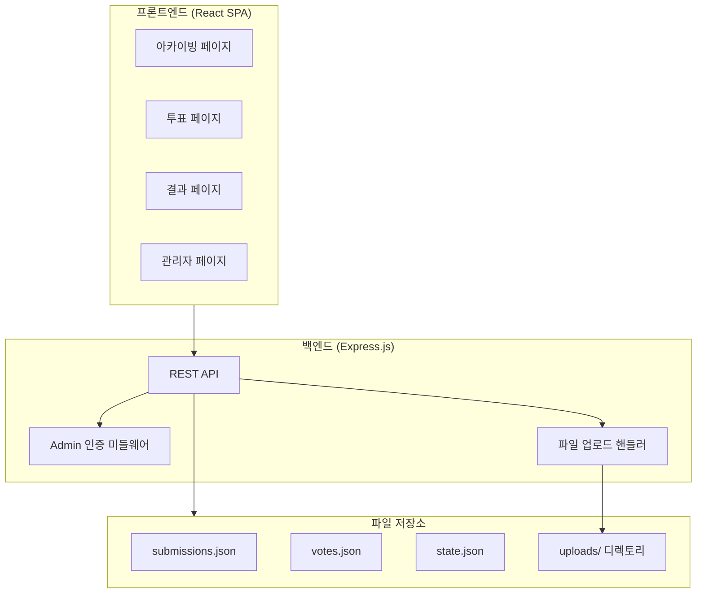
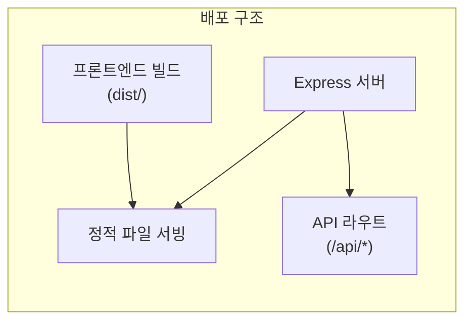
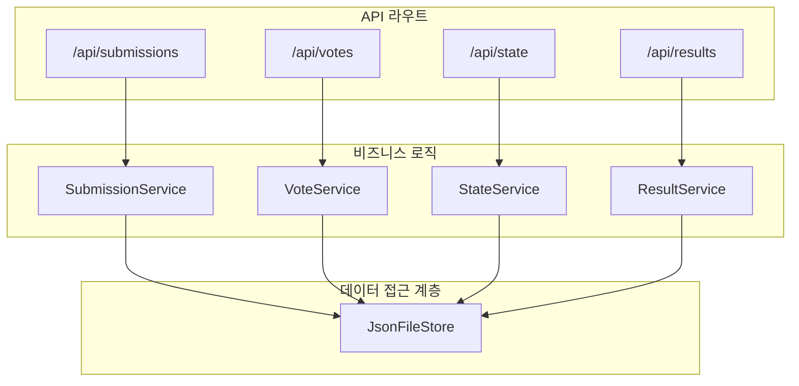

# Design Document: AI 바이브 코딩 콘테스트

## Overview

DX팀 내부 AI 바이브 코딩 콘테스트를 위한 소규모 웹 애플리케이션이다. 참가자들의 제출물을 아카이빙하고, 3개 카테고리별 투표를 진행하며, 결과를 집계하여 우승자를 선정하는 시스템을 구현한다.

### 설계 방향

- **PC 버전 최적화**: 데스크톱 브라우저를 주요 타겟으로 설계 (최소 너비 1024px 기준)
- **심플함 우선**: DX팀 내부 소규모 도구이므로 과도한 인프라 없이 간단하게 구성
- **단일 배포**: 프론트엔드와 백엔드를 하나의 프로젝트로 관리
- **파일 기반 저장소**: 소규모 데이터이므로 별도 DB 없이 JSON 파일로 관리
- **정적 호스팅 가능**: 빌드 결과물을 정적 서버에 배포 가능한 구조

### 기술 스택

| 레이어 | 기술 | 선택 이유 |
|--------|------|-----------|
| 프론트엔드 | React + TypeScript | 컴포넌트 기반 UI, 타입 안전성 |
| 번들러 | Vite | 빠른 개발 서버, 간단한 설정 |
| 백엔드 | Express.js (Node.js) | 가볍고 빠른 API 서버 |
| 데이터 저장 | JSON 파일 (fs) | DB 설치 불필요, 소규모 데이터에 적합 |
| 파일 업로드 | multer | Express용 파일 업로드 미들웨어 |
| 스타일링 | CSS Modules 또는 Tailwind CSS | 간단하고 충돌 없는 스타일링 |

## Architecture

### High-Level Architecture



### 시스템 구성



단일 Express 서버가 프론트엔드 정적 파일과 API를 모두 서빙하는 구조. 별도의 리버스 프록시나 복잡한 배포 구성이 불필요하다.

### Low-Level Architecture



## Components and Interfaces

### UI/UX 설계 (PC 최적화)

#### 레이아웃 원칙

- **최소 뷰포트**: 1024px 이상 (데스크톱 브라우저 기준)
- **콘텐츠 최대 너비**: 1200px, 중앙 정렬
- **네비게이션**: 상단 고정 헤더에 페이지 탭 (아카이빙 | 투표 | 결과)
- **카드 그리드**: 3~4열 그리드 레이아웃 (PC 화면에 맞게)

#### 아카이빙 페이지 와이어프레임

```
┌─────────────────────────────────────────────────────────────┐
│  🏆 DX팀 AI 바이브 코딩 콘테스트        [아카이빙] [투표] [결과]  │
├─────────────────────────────────────────────────────────────┤
│  투표 상태: ● 진행중                         총 N개 출품작  │
├─────────────────────────────────────────────────────────────┤
│  ┌──────────┐  ┌──────────┐  ┌──────────┐  ┌──────────┐   │
│  │ 참가자A  │  │ 참가자B  │  │ 참가자C  │  │ 참가자D  │   │
│  │ ──────── │  │ ──────── │  │ ──────── │  │ ──────── │   │
│  │ 제작배경 │  │ 제작배경 │  │ 제작배경 │  │ 제작배경 │   │
│  │ 설명...  │  │ 설명...  │  │ 설명...  │  │ 설명...  │   │
│  │ [GitHub] │  │  [HTML]  │  │ [GitHub] │  │  [HTML]  │   │
│  └──────────┘  └──────────┘  └──────────┘  └──────────┘   │
└─────────────────────────────────────────────────────────────┘
```

#### 투표 페이지 와이어프레임

```
┌─────────────────────────────────────────────────────────────┐
│  🏆 DX팀 AI 바이브 코딩 콘테스트        [아카이빙] [투표] [결과]  │
├─────────────────────────────────────────────────────────────┤
│                                                             │
│  📝 투표자 이름                                             │
│  ┌───────────────────────────────────┐                      │
│  │ 이름을 입력하세요 (중복 투표 방지) │                      │
│  └───────────────────────────────────┘                      │
│                                                             │
│  ─────────────────────────────────────────────────────────  │
│                                                             │
│  🎨 아이디어 미쵸따 (가장 크리에이티브한 결과물)            │
│  ○ 참가자A - 제작배경 설명...                               │
│  ● 참가자B - 제작배경 설명...                               │
│  ○ 참가자C - 제작배경 설명...                               │
│                                                             │
│  📐 기획 장인 (섬세한 기획 + 탄탄한 설계)                   │
│  ● 참가자A - 제작배경 설명...                               │
│  ○ 참가자B - 제작배경 설명...                               │
│  ○ 참가자C - 제작배경 설명...                               │
│                                                             │
│  🔄 자꾸 손이가 (다시 써보고 싶은 서비스)                   │
│  ○ 참가자A - 제작배경 설명...                               │
│  ○ 참가자B - 제작배경 설명...                               │
│  ● 참가자C - 제작배경 설명...                               │
│                                                             │
│              ┌──────────────────┐                           │
│              │    투표하기 🗳️    │                           │
│              └──────────────────┘                           │
└─────────────────────────────────────────────────────────────┘
```

투표 페이지 핵심:
- **투표자 이름 입력란**: 페이지 최상단에 위치, 필수 입력 필드
- 이름은 중복 투표 방지용으로 사용됨을 안내 텍스트로 표시
- 3개 카테고리를 수직으로 나열하여 한 화면에서 모두 선택 가능
- 각 카테고리는 라디오 버튼 형식으로 참가자 1명만 선택
- 동일 참가자를 여러 카테고리에서 선택 시 실시간 경고 표시

### 프론트엔드 컴포넌트

```
src/
├── pages/
│   ├── ArchivePage.tsx        # 아카이빙 페이지
│   ├── VotePage.tsx           # 투표 페이지
│   ├── ResultPage.tsx         # 결과 페이지
│   └── AdminPage.tsx          # 관리자 페이지
├── components/
│   ├── SubmissionCard.tsx     # 제출물 카드
│   ├── VoterNameInput.tsx     # 투표자 이름 입력 컴포넌트
│   ├── VotingForm.tsx         # 투표 폼 (카테고리별 선택)
│   ├── CategorySelector.tsx   # 카테고리별 참가자 선택 라디오 그룹
│   ├── ResultBoard.tsx        # 결과 보드
│   └── StatusBadge.tsx        # 투표 상태 배지
├── services/
│   └── api.ts                 # API 클라이언트
├── types/
│   └── index.ts               # 공유 타입 정의
└── App.tsx                    # 라우터 설정
```

### 백엔드 구조

```
server/
├── routes/
│   ├── submissions.ts         # 제출물 CRUD API
│   ├── votes.ts               # 투표 API
│   ├── state.ts               # 투표 상태 API
│   └── results.ts             # 결과 조회 API
├── services/
│   ├── SubmissionService.ts   # 제출물 비즈니스 로직
│   ├── VoteService.ts         # 투표 비즈니스 로직
│   ├── StateService.ts        # 상태 관리 로직
│   └── ResultService.ts       # 결과 계산 로직
├── middleware/
│   └── adminAuth.ts           # Admin 인증 미들웨어
├── store/
│   └── JsonFileStore.ts       # JSON 파일 기반 저장소
├── validators/
│   └── index.ts               # 입력 검증 함수
└── index.ts                   # 서버 진입점
```

### API 인터페이스

#### 제출물 API

| Method | Endpoint | 설명 | 인증 |
|--------|----------|------|------|
| GET | `/api/submissions` | 모든 제출물 목록 조회 | - |
| POST | `/api/submissions` | 새 제출물 등록 | Admin |
| PUT | `/api/submissions/:id` | 제출물 수정 | Admin |
| DELETE | `/api/submissions/:id` | 제출물 삭제 | Admin |

#### 투표 API

| Method | Endpoint | 설명 | 인증 |
|--------|----------|------|------|
| POST | `/api/votes` | 투표 제출 | - |
| GET | `/api/votes/voters` | 투표 완료자 목록 | Admin |

#### 상태 API

| Method | Endpoint | 설명 | 인증 |
|--------|----------|------|------|
| GET | `/api/state` | 현재 투표 상태 조회 | - |
| PUT | `/api/state/advance` | 투표 상태 전진 | Admin |

#### 결과 API

| Method | Endpoint | 설명 | 인증 |
|--------|----------|------|------|
| GET | `/api/results` | 투표 결과 조회 | - (상태="종료" 시에만 응답) |

### Admin 인증

소규모 내부 도구이므로 간단한 비밀번호 기반 인증을 사용한다:
- Admin 페이지 접근 시 비밀번호 입력
- 비밀번호는 서버 환경변수(`ADMIN_PASSWORD`)로 설정
- 요청 헤더에 `X-Admin-Token` 포함하여 인증
- 토큰은 서버 시작 시 생성되는 세션 기반 값

## Data Models

### Submission (제출물)

```typescript
interface Submission {
  id: string;                    // UUID
  participantName: string;       // 참가자 이름 (최대 50자)
  type: 'html' | 'github';      // 제출 유형
  url: string;                   // HTML 파일 URL 또는 GitHub 링크
  description: string;           // 제작 배경 설명 (10~200자)
  createdAt: string;             // 등록일 (ISO 8601)
  updatedAt: string;             // 수정일 (ISO 8601)
}
```

### Vote (투표)

```typescript
interface Vote {
  id: string;                    // UUID
  voterName: string;             // 투표자 이름
  normalizedVoterName: string;   // 정규화된 투표자 이름 (공백제거, 소문자)
  selections: {
    ideaMichiotta: string;       // "아이디어 미쵸따" 선택 (submission id)
    planningMaster: string;      // "기획 장인" 선택 (submission id)
    keepTouching: string;        // "자꾸 손이가" 선택 (submission id)
  };
  submittedAt: string;           // 투표 시간 (ISO 8601)
}
```

### VotingState (투표 상태)

```typescript
interface VotingState {
  status: 'not_started' | 'in_progress' | 'ended'; // 투표 상태
  startedAt: string | null;      // 투표 시작 시간
  endedAt: string | null;        // 투표 종료 시간
}
```

### VoteResult (투표 결과)

```typescript
interface CategoryResult {
  participantName: string;
  submissionId: string;
  voteCount: number;
  isWinner: boolean;             // 동점 시 복수 가능
}

interface VoteResult {
  categories: {
    ideaMichiotta: CategoryResult[];    // 내림차순 정렬
    planningMaster: CategoryResult[];
    keepTouching: CategoryResult[];
  };
  overall: {
    participantName: string;
    totalVoteCount: number;
    isWinner: boolean;           // 동점 시 복수 가능
  }[];
}
```

### 이름 정규화 로직

```typescript
function normalizeName(name: string): string {
  return name.trim().replace(/\s+/g, '').toLowerCase();
}
```

중복 투표 판별 시 `normalizedVoterName`으로 비교한다. 예: "홍 길동", "홍길동", "홍길 동"은 모두 동일 투표자로 취급한다.


## Correctness Properties

*A property is a characteristic or behavior that should hold true across all valid executions of a system-essentially, a formal statement about what the system should do. Properties serve as the bridge between human-readable specifications and machine-verifiable correctness guarantees.*

### Property 1: 제출물 데이터 왕복 보존 (Submission Data Round-Trip)

*For any* valid submission (참가자 이름 1~50자, 제작 배경 설명 10~200자, 유효한 제출 유형과 URL), 해당 제출물을 등록한 후 조회하면 원래 입력한 모든 필드 값이 동일하게 보존되어야 한다. 수정의 경우에도, 수정 후 조회하면 수정된 필드가 정확히 반영되어야 한다.

**Validates: Requirements 1.1, 1.4**

### Property 2: GitHub URL 검증 (GitHub URL Validation)

*For any* 문자열, 해당 문자열이 "https://github.com/"으로 시작하면 GitHub 유형 제출물 등록이 성공하고, 시작하지 않으면 등록이 거부되어야 한다.

**Validates: Requirements 1.3**

### Property 3: 무효한 제출물 거부 (Invalid Submission Rejection)

*For any* 제출물 등록 요청에서, 참가자 이름이 빈 문자열이거나 공백만으로 구성된 경우, 또는 제작 배경 설명이 10자 미만이거나 200자를 초과하는 경우, 시스템은 등록을 거부하고 제출물 저장소의 상태는 변경되지 않아야 한다.

**Validates: Requirements 1.6, 1.7**

### Property 4: 제출물 개수 불변식 (Submission Count Invariant)

*For any* 시점에서, 시스템이 보고하는 제출물 총 개수는 저장소에 실제 존재하는 제출물의 수와 항상 동일해야 한다. 등록 시 +1, 삭제 시 -1이 정확히 반영되어야 한다.

**Validates: Requirements 1.8**

### Property 5: 제출물 최신순 정렬 (Submissions Sorted by Date)

*For any* 제출물 목록 조회 시, 반환된 목록은 등록일(`createdAt`) 기준 내림차순(최신이 먼저)으로 정렬되어 있어야 한다. 즉, 목록의 모든 연속된 두 항목에 대해 앞 항목의 등록일이 뒤 항목의 등록일보다 같거나 늦어야 한다.

**Validates: Requirements 2.1**

### Property 6: 투표 유효성 - 카테고리당 정확히 1명 선택 (Vote Completeness)

*For any* 투표 제출 요청에서, 3개 카테고리 모두에 정확히 1개의 유효한 제출물 ID가 선택되어야 투표가 성공한다. 하나라도 누락되거나 존재하지 않는 제출물 ID인 경우 투표는 거부되어야 한다.

**Validates: Requirements 3.2, 3.5**

### Property 7: 동일 참가자 다중 카테고리 선택 허용 (Duplicate Participant Across Categories Allowed)

*For any* 투표 제출 요청에서, 3개 카테고리 각각에 정확히 1개의 유효한 제출물이 선택되어 있으면, 동일 참가자가 둘 이상의 카테고리에서 선택되었더라도 투표는 정상적으로 접수되어야 한다.

**Validates: Requirements 3.3**

### Property 8: 투표는 "진행중" 상태에서만 가능 (Votes Only In Progress)

*For any* 유효한 투표 요청에 대해, 투표 상태가 "in_progress"일 때만 투표가 접수되어야 한다. 상태가 "not_started" 또는 "ended"인 경우, 어떤 투표 요청이든 거부되어야 한다.

**Validates: Requirements 4.1, 4.5**

### Property 9: 투표 상태 전환 단방향성 (Unidirectional State Transitions)

*For any* 투표 상태에서, 허용되는 전환은 오직 "not_started" → "in_progress" → "ended" 순서뿐이다. 현재 상태에서 이전 상태로의 전환 또는 단계를 건너뛰는 전환은 항상 거부되어야 한다.

**Validates: Requirements 4.6**

### Property 10: 투표 집계 정확성 (Vote Tally Correctness)

*For any* 투표 데이터 집합에 대해, 각 카테고리별 참가자의 득표 수는 해당 카테고리에서 그 참가자를 선택한 투표의 수와 정확히 일치해야 하며, 종합 득표 수는 3개 카테고리 득표 수의 합과 일치해야 한다.

**Validates: Requirements 5.1**

### Property 11: 우승자 결정 및 동점 처리 (Winner Determination with Ties)

*For any* 투표 결과에서, 우승자로 표시된 참가자의 득표 수는 해당 카테고리(또는 종합)의 모든 참가자 중 최대값이어야 하며, 최대 득표수를 가진 모든 참가자가 빠짐없이 우승자로 표시되어야 한다.

**Validates: Requirements 5.2, 5.3**

### Property 12: 결과 내림차순 정렬 (Results Sorted Descending)

*For any* 투표 결과 조회 시, 각 카테고리의 참가자 목록은 득표 수(`voteCount`) 기준 내림차순으로 정렬되어 있어야 한다.

**Validates: Requirements 5.4**

### Property 13: 결과는 종료 상태에서만 접근 가능 (Results Only When Ended)

*For any* 결과 조회 요청에 대해, 투표 상태가 "ended"일 때만 결과 데이터를 반환해야 한다. "not_started" 또는 "in_progress" 상태에서는 결과를 제공하지 않아야 한다.

**Validates: Requirements 5.5**

### Property 14: 이름 정규화 및 중복 투표 탐지 (Name Normalization and Duplicate Detection)

*For any* 투표자 이름에 대해, 이름 정규화 함수(`normalizeName`)는 앞뒤 공백 제거, 내부 공백 제거, 소문자 변환을 수행하여, 동일한 기본 문자 조합의 모든 변형(대소문자, 공백 배치 차이)에 대해 동일한 정규화 결과를 생성해야 한다. 그리고 정규화된 이름이 이미 투표 기록에 존재하면 중복 투표로 판단하여 거부해야 한다.

**Validates: Requirements 3.6, 6.1, 6.2**

### Property 15: 무효한 투표자 이름 거부 (Invalid Voter Name Rejection)

*For any* 투표 요청에서, 투표자 이름이 빈 문자열이거나 공백만으로 구성된 경우, 또는 50자를 초과하는 경우, 투표는 거부되고 투표 저장소의 상태는 변경되지 않아야 한다.

**Validates: Requirements 6.3, 6.4**

## Error Handling

### 클라이언트 에러 (4xx)

| 상황 | HTTP 상태 | 응답 |
|------|-----------|------|
| 유효하지 않은 제출물 데이터 | 400 Bad Request | `{ error: string, field?: string }` |
| 유효하지 않은 투표 데이터 | 400 Bad Request | `{ error: string, missingCategories?: string[] }` |
| 중복 투표 시도 | 409 Conflict | `{ error: "이미 투표가 완료되었습니다" }` |
| 투표 불가 상태에서 투표 시도 | 403 Forbidden | `{ error: string, currentStatus: string }` |
| Admin 인증 실패 | 401 Unauthorized | `{ error: "관리자 권한이 필요합니다" }` |
| 존재하지 않는 제출물 | 404 Not Found | `{ error: "제출물을 찾을 수 없습니다" }` |
| 잘못된 상태 전환 | 400 Bad Request | `{ error: string, currentStatus: string }` |

### 서버 에러 (5xx)

| 상황 | 처리 방식 |
|------|-----------|
| JSON 파일 읽기/쓰기 실패 | 500 응답 + 에러 로깅 |
| 파일 업로드 실패 | 500 응답 + 임시 파일 정리 |

### 프론트엔드 에러 처리

- API 호출 실패 시 사용자에게 토스트/알림으로 에러 메시지 표시
- 네트워크 오류 시 재시도 안내
- 폼 유효성 검사는 클라이언트에서 우선 수행 (서버 검증과 중복)

### 데이터 무결성

- JSON 파일 쓰기 시 임시 파일에 먼저 작성 후 원자적(rename) 교체
- 동시 쓰기 방지를 위한 간단한 파일 잠금 (소규모이므로 in-memory mutex 충분)

## Testing Strategy

### 테스트 레이어

```
┌─────────────────────────────────────────┐
│ E2E 테스트 (선택사항, 수동 테스트 가능) │
├─────────────────────────────────────────┤
│ 통합 테스트 (API 라우트 테스트)         │
├─────────────────────────────────────────┤
│ Property-Based 테스트 (비즈니스 로직)   │
├─────────────────────────────────────────┤
│ Unit 테스트 (유틸리티, 검증 함수)       │
└─────────────────────────────────────────┘
```

### Property-Based Testing

이 프로젝트는 순수 비즈니스 로직(검증, 집계, 정규화, 상태 전환)이 핵심이므로 property-based testing에 적합하다.

- **라이브러리**: [fast-check](https://github.com/dubzzz/fast-check) (TypeScript PBT 라이브러리)
- **테스트 러너**: Vitest
- **최소 반복 횟수**: 100회 per property
- **태그 형식**: `Feature: ai-vibe-coding-contest, Property {N}: {description}`

#### PBT 대상 모듈

| 모듈 | 테스트 대상 Property |
|------|---------------------|
| `validators/submission.ts` | Property 2, 3 |
| `services/SubmissionService.ts` | Property 1, 4, 5 |
| `validators/vote.ts` | Property 6, 7, 15 |
| `services/VoteService.ts` | Property 8, 14 |
| `services/StateService.ts` | Property 9 |
| `services/ResultService.ts` | Property 10, 11, 12, 13 |

### Unit 테스트 (Example-Based)

- Admin 인증 미들웨어 동작 확인
- 파일 업로드 성공/실패 시나리오
- 제출물 삭제 시 확인 프롬프트 표시
- 투표 성공 시 확인 메시지 표시
- 빈 상태 페이지 메시지 표시
- 상태 전환 성공 케이스 (not_started → in_progress → ended)

### 통합 테스트

- API 엔드포인트별 정상/에러 응답 검증
- 파일 업로드 → URL 접근 가능 여부
- Admin 인증 토큰 포함/미포함 시 동작 차이

### 테스트 실행 명령

```bash
# 전체 테스트
npm run test

# Property-Based 테스트만 실행
npm run test -- --run --grep "Property"

# 특정 서비스 테스트
npm run test -- --run services/ResultService
```
